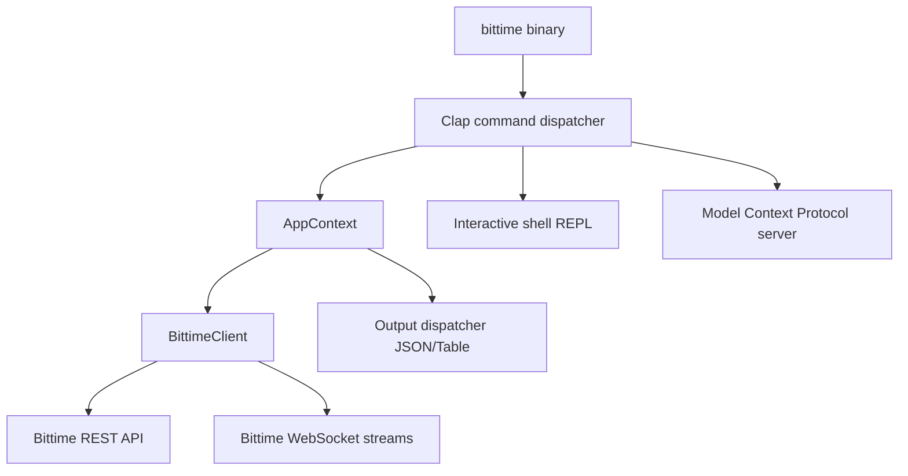

# bittime-cli

Unofficial Rust CLI for the Bittime exchange. Use it to inspect markets, manage account data, place spot orders, stream live WebSocket events, and expose the same command surface to agents through MCP.

[](https://www.rust-lang.org/)
[](#quick-start)
[](#websocket-streaming)
[](#mcp-server)

## Highlights

- Public market data: ping, server time, exchange info, tickers, order book, trades, aggregate trades.
- Private account data: balances, account info, assets, order history, trade history.
- Spot trading: market and limit buy/sell, query order, cancel order, open orders.
- Funding and OTC: crypto deposit/withdraw history, OTC VA code, OTC IDR deposit and withdrawal history.
- Real-time streams: market depth, private order events, private balance events, raw user channels.
- Automation-friendly output: human tables by default, JSON envelopes with `-o json`.
- Credential resolution: CLI flags, environment variables, or `~/.config/bittime/config.toml`.
- Agent support: MCP server mode for tool discovery and JSON-RPC execution.

## Installation

Install from source:

```bash
git clone https://github.com/ibidathoillah/bittime-cli.git
cd bittime-cli
cargo install --path .
```

Install from crates.io:

```bash
cargo install bittime-cli
```

Install from npm:

```bash
npm install -g bittime-cli
```

Run with Docker:

```bash
docker run --rm ibidathoillah/bittime-cli --help
docker run --rm -e BITTIME_API_KEY -e BITTIME_API_SECRET ibidathoillah/bittime-cli balance
```

Run from the checkout:

```bash
cargo build
./target/debug/bittime --help
```

## Quick Start

Market data does not require credentials:

```bash
bittime ping
bittime ticker USDTIDR
bittime orderbook USDTIDR --count 10
bittime -o json book-ticker USDTIDR
```

Configure private API credentials:

```bash
bittime auth set --api-key YOUR_API_KEY --api-secret YOUR_API_SECRET
bittime auth test
```

Or use environment variables:

```bash
export BITTIME_API_KEY=your_api_key
export BITTIME_API_SECRET=your_api_secret
```

Credential priority:

1. `--api-key` and `--api-secret`
2. `BITTIME_API_KEY` and `BITTIME_API_SECRET`
3. `~/.config/bittime/config.toml`

## Command Reference

Global options:

```text
bittime [OPTIONS] <COMMAND>

Options:
  -o, --output <table|json>      Output format [default: table]
      --api-key <API_KEY>        API key override
      --api-secret <API_SECRET>  API secret override
  -v, --verbose                  Enable verbose logs
      --host <HOST>              Override API host
```

### Market

```bash
bittime ping
bittime server-time
bittime exchange-info
bittime ticker USDTIDR
bittime ticker-all
bittime price USDTIDR
bittime book-ticker USDTIDR
bittime orderbook USDTIDR --count 10
bittime trades USDTIDR --count 5
bittime agg-trades USDTIDR --count 5
bittime historical-trades USDTIDR --count 5
```

### Account

```bash
bittime account-info
bittime balance
bittime account-info-v2
bittime assets usdt
bittime trades-history USDTIDR
bittime trades-history-v2 USDTIDR --since 123
bittime trades-legacy USDTIDR
```

### Trading

```bash
bittime order buy USDTIDR -t LIMIT -p 16000 --volume 1
bittime order sell USDTIDR -t MARKET --volume 1
bittime order cancel USDTIDR --order-id 123456
bittime order query USDTIDR --order-id 123456
bittime order open-orders USDTIDR
bittime order all-orders USDTIDR
bittime order pending-orders USDTIDR
bittime order book-orders USDTIDR --count 5
```

Notes:

- `pending-orders` is a compatibility alias for Bittime's documented `openOrders` endpoint.
- `book-orders` returns public order book depth from Bittime's documented `depth` endpoint.

### Funding

```bash
bittime withdraw --asset USDT --volume 100 --address 0x... --network ERC20
bittime withdrawal status --asset usdt
bittime deposit status --asset usdt
bittime deposit va --bank-id 7
bittime deposit otc-status --count 10
bittime withdrawal otc-status --count 10
```

### WebSocket Streaming

Market depth:

```bash
bittime ws depth usdtidr
bittime ws depth usdtidr --limit 1 --seconds 15
```

Private streams:

```bash
bittime ws orders
bittime ws balances
bittime ws user user_order_update
bittime ws user user_balance_update
```

The WebSocket client handles Bittime's market gzip frames, market ping/pong, user-stream ping/pong, listen-key creation, and listen-key keepalive.

### Interactive Shell

```bash
bittime shell
```

### MCP Server

```bash
bittime mcp
```

The MCP server exposes CLI commands as machine-readable tools over JSON-RPC stdio.

## E2E Testing

The repository includes live API smoke tests:

```bash
./scripts/e2e_test.sh --public
./scripts/e2e_test.sh --private
./scripts/e2e_test.sh --ws
```

Environment knobs:

```bash
BITTIME_TEST_PAIR=USDTIDR
BITTIME_TEST_COIN=usdt
BITTIME_BIN=./target/debug/bittime
```

Latest local verification:

```text
cargo test: 16 passed
./scripts/e2e_test.sh --public: 22 passed
./scripts/e2e_test.sh --private: 19 passed
./scripts/e2e_test.sh --ws: 4 passed
```

## API Coverage

- REST base: `https://openapi.bittime.com`
- Market WebSocket: `wss://ws.bittime.com/market/ws`
- User WebSocket: `wss://wsapi.bittime.com`
- API docs: https://bittime-docs.github.io/

## Architecture



## Security

- Credentials are stored with `0600` permissions when using `bittime auth set`.
- Prefer read-only API keys for account inspection and WebSocket monitoring.
- Use IP restrictions on exchange API keys when possible.
- Never commit real API keys, secrets, or listen keys.

## Development

```bash
cargo fmt
cargo test
cargo build
```

## License

MIT

## Disclaimer

This project is unofficial and is not affiliated with or endorsed by Bittime. Cryptocurrency trading is risky; review commands carefully before using write-capable API keys.
